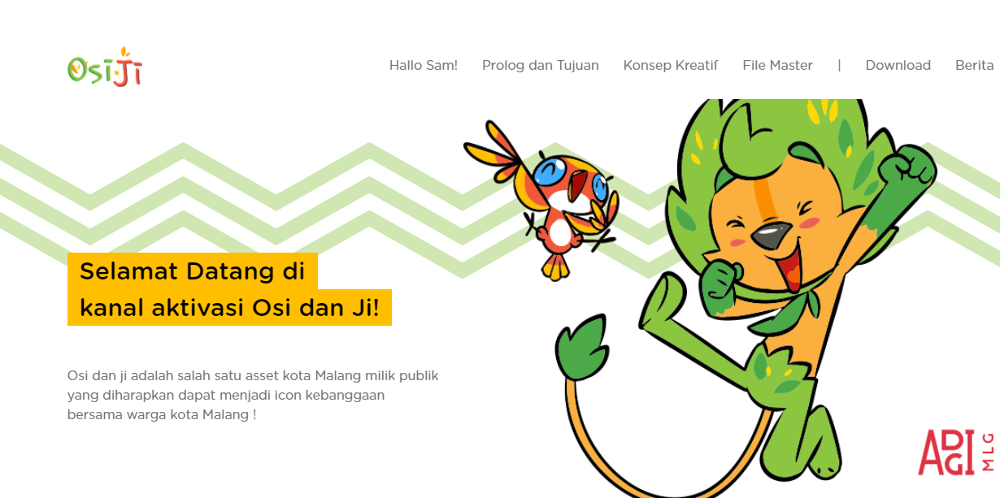

<html lang="en">

<head>
  <meta charset="UTF-8" />
  <meta name="viewport" content="width=device-width, initial-scale=1.0" />
  <meta http-equiv="X-UA-Compatible" content="ie=edge" />
  <title>Portofolio Dimas Bayu</title>

  <link rel="stylesheet" href="https://fonts.googleapis.com/css?family=Open+Sans:400,600" />
  <link rel="stylesheet" href="css/bootstrap.min.css" />
  <link rel="stylesheet" href="css/templatemo-style.css" />
  
</head>

<body>
  

    <header class="tm-header text-center">
      <h1 class="tm-title text-uppercase">Portofolio</h1>
      
<i></i>

    </header>

    <section class="tm-section marbot0" id="intro">
      <nav class="tm-nav">
        <ul>
          <li class="active">
            <a href="#intro">Intro</a>
          </li>
          <li>
            <a href="#projek">MyProject</a>
          </li>
        </ul>
      </nav>
      

        <figure class="mb-0">
          
        </figure>
        

          <h2 class="tm-page-title">About Me</h2>
          

            Hello! I'm Dimas Bayu
            

              
            

          

          

            My mom gave birth to me in Jakarta 1 April 1999
          

          

            I am currently college student who passionate
            about Programing and design
          

          

            
            
          

        

      

    </section>

    

      <h1 class="tm-title text-uppercase">MyProject</h1>
    

    

      

        

          

            

              

                <figure class="effect-bubba">
                  
                  <figcaption>
                    <h2>Osi & Ji</h2>
                    
Website maskot kota Malang

                  </figcaption>
                </figure>
              

              

                <figure class="effect-bubba">
                  
                  <figcaption>
                    <h2>PIS</h2>
                    
Website Profile Image Studio

                  </figcaption>
                </figure>
              

              

                <figure class="effect-bubba">
                  
                  <figcaption>
                    <h2>SeKo</h2>
                    
Website tugas kuliah

                  </figcaption>
                </figure>
              

            

          

        

      

    

    <footer>
      Copyright 2021 Dimas Bayu
    </footer>
  

</body>

</html>
